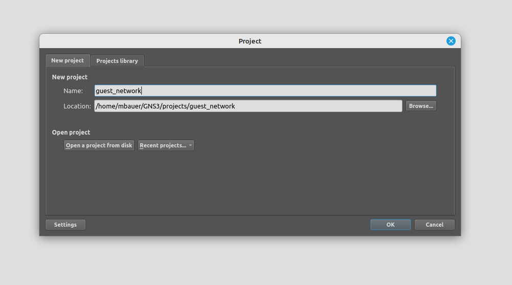
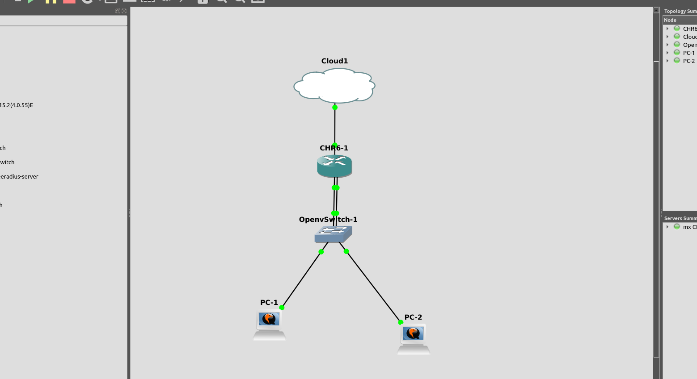
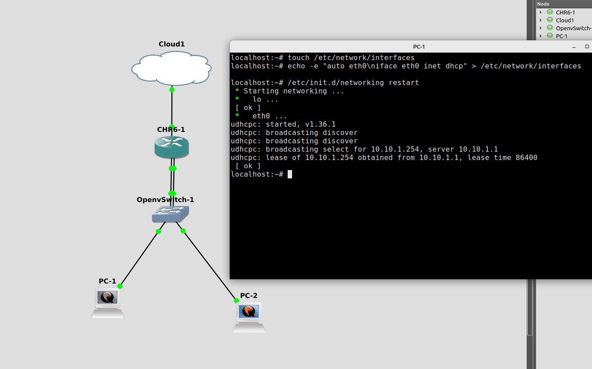
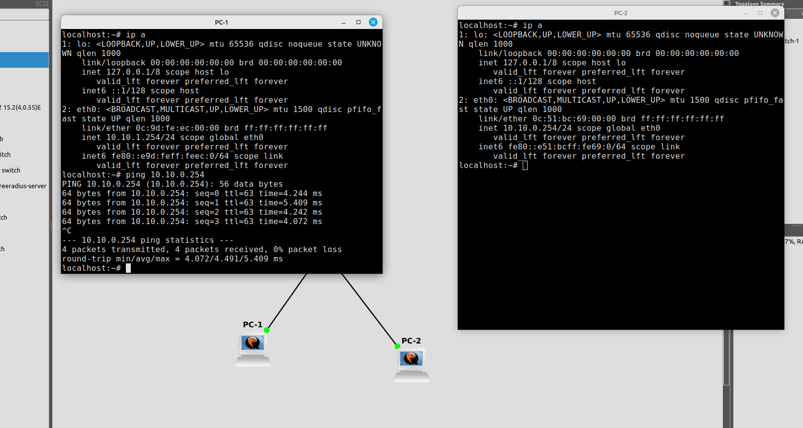
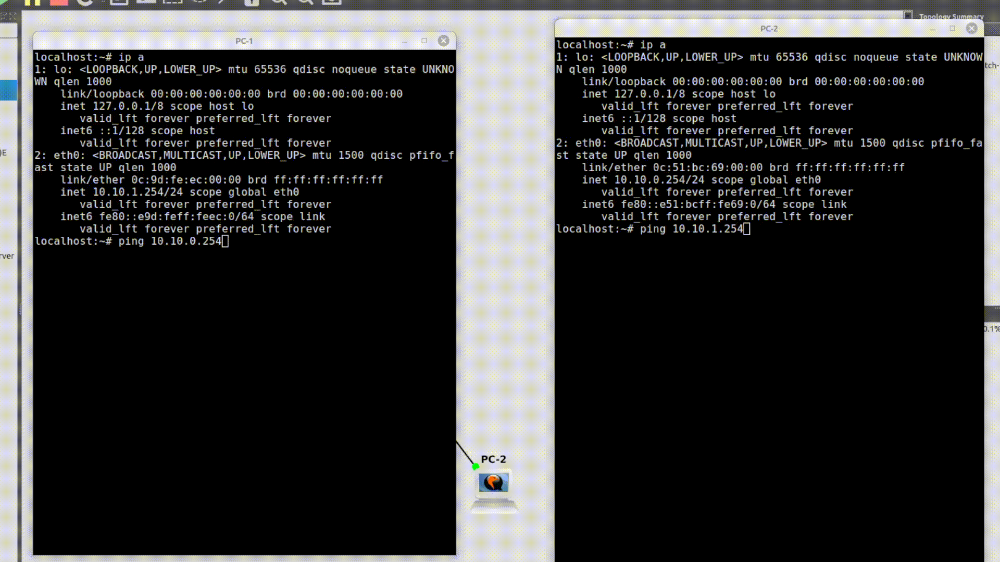
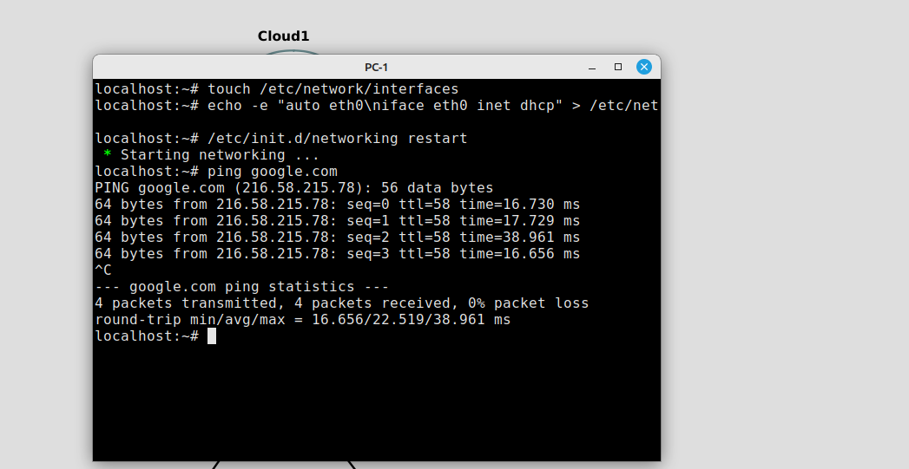
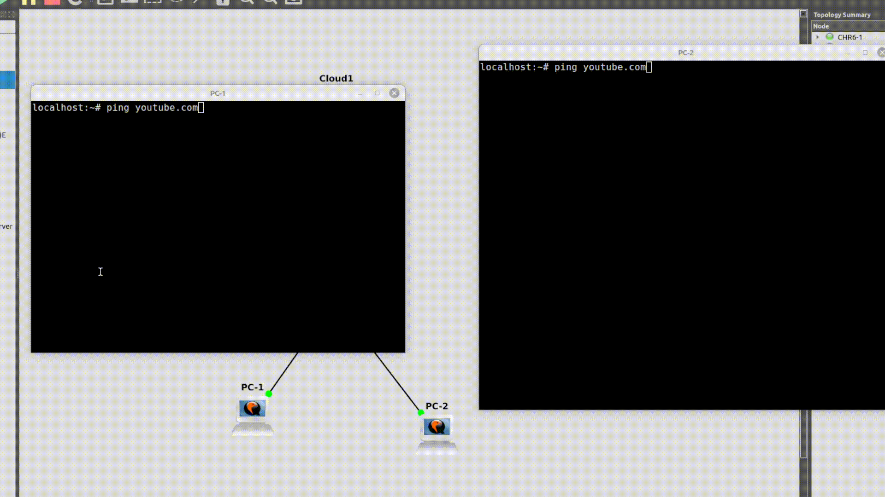
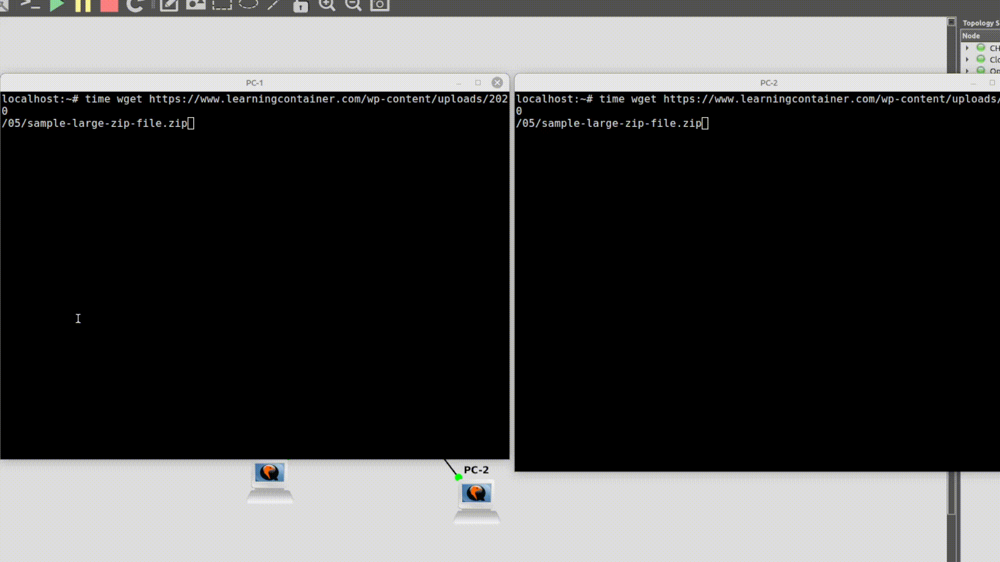

# Guest network in GNS3

- [Guest network in GNS3](#guest-network-in-gns3)
	- [Introduction](#introduction)
	- [Prerequisites](#prerequisites)
		- [Install GNS3](#install-gns3)
		- [Create GNS3 project](#create-gns3-project)
		- [Download and install images](#download-and-install-images)
			- [Open vSwitch](#open-vswitch)
			- [Mikrotik Cloud Hosted Router](#mikrotik-cloud-hosted-router)
			- [Alpine Linux](#alpine-linux)
	- [Create network topology](#create-network-topology)
	- [Router configuration](#router-configuration)
	- [OpenvSwitch setup](#openvswitch-setup)
	- [Alpine Linux setup](#alpine-linux-setup)
	- [Firewall rules](#firewall-rules)
	- [Firewall layer7-protocol rules](#firewall-layer7-protocol-rules)
	- [Bandwith limitation](#bandwith-limitation)
	- [Troubleshooting](#troubleshooting)


## Introduction

The goal is to set up a guest network, which will operate alongside our internal network, but with a different set of policies. The network is configured, managed and tested in a virtual environment - using Qemu VMs and Docker containers. GNS3 is used for putting it all together, as well as graphical representation of the network.

## Prerequisites
### Install GNS3 

```sh
sudo add-apt-repository ppa:gns3/ppa
sudo apt update                                
sudo apt install gns3-gui gns3-server

sudo usermod -aG ubridge,libvirt,kvm,wireshark,docker $(whoami)
```

### Create GNS3 project


### Download and install images
#### Open vSwitch
In the GNS3 project: Browse all devices -> New template -> Install an appliance from the GNS3 server -> Switches -> Open vSwitch -> Install the appliance on your local computer

#### Mikrotik Cloud Hosted Router 

1. Go to [the Mikrotik website](https://mikrotik.com/download/) and download raw disk image of Mikrotik CHR
2. In the GNS3 project: Browse all devices -> New template -> Manually create a new template -> Qemu VMs -> New -> specify name, Qemu binary, console type -> New image -> add the downloaded disk image -> Finish -> Apply


#### Alpine Linux
1. Go to [the Alpine Linux website](https://alpinelinux.org/downloads/) and download iso file (standard, x86_64)
2. In the GNS3 project: Browse all devices -> New template -> Manually create a new template -> Qemu VMs -> New -> specify name, Qemu binary, console type -> New image -> add the downloaded disk image -> Finish -> Apply


## Create network topology



## Router configuration

- create two networks

```sh
[admin@MikroTik] > ip address add address=10.10.0.1/24 interface=ether2
[admin@MikroTik] > ip address add address=10.10.1.1/24 interface=ether3
```
- setup DHCP and DNS for both networks

```sh
[admin@MikroTik] > ip dhcp-server
[admin@MikroTik] /ip dhcp-server> setup
Select interface to run DHCP server on

dhcp server interface: ether2
Select network for DHCP addresses

dhcp address space: 10.10.0.0/24
Select gateway for given network

gateway for dhcp network: 10.10.0.1
Select pool of ip addresses given out by DHCP server

addresses to give out: 10.10.0.2-10.10.0.254
Select DNS servers

dns servers: 192.168.0.1,192.168.0.2
Select lease time

lease time: 1d
[admin@MikroTik] /ip dhcp-server>

[admin@MikroTik] /ip dhcp-server> setup
Select interface to run DHCP server on

dhcp server interface: ether3
Select network for DHCP addresses

dhcp address space: 10.10.1.0/24
Select gateway for given network

gateway for dhcp network: 10.10.1.1
Select pool of ip addresses given out by DHCP server

addresses to give out: 10.10.1.2-10.10.1.254
Select DNS servers

dns servers: 192.168.0.1,192.168.0.2
Select lease time

lease time: 1d
[admin@MikroTik] /ip dhcp-server>

```

## OpenvSwitch setup

- Set VLANs in order to block L2 connectivity

```
ovs-vsctl set port eth0 tag=20
ovs-vsctl set port eth1 tag=10
ovs-vsctl set port eth2 tag=20
ovs-vsctl set port eth3 tag=10
```

## Alpine Linux setup

- Request IP address from DHCP on both machines

```sh
touch /etc/network/interfaces
echo -e "auto eth0\niface eth0 inet dhcp" > /etc/network/interfaces
/etc/init.d/networking restart
```


- Make sure that the devices are on different networks

PC-1:

```sh
localhost:~$ ip a | grep "eth0"
2: eth0: <BROADCAST,MULTICAST,UP,LOWER_UP> mtu 1500 qdisc pfifo_fast state UP qlen 1000
	inet 10.10.1.254/24 scope global eth0

```
PC-2:

```sh
localhost:~$ ip a | grep "eth0"
2: eth0: <BROADCAST,MULTICAST,UP,LOWER_UP> mtu 1500 qdisc pfifo_fast state UP qlen 1000
	inet 10.10.0.254/24 scope global eth0

```

- The should be connection between hosts even though VLANs are set, since there aren't any firewall rules on L3



## Firewall rules

- Set up firewall rules so that the guest network cannot access the internal network, but allow
  connection from the internal network to the guest network

```sh
[admin@MikroTik] > ip firewall filter 
[admin@MikroTik] /ip firewall filter>
add chain=forward src-address=10.10.0.0/24 dst-address=10.10.1.0/24 action=accept connection-state=new
add chain=forward src-address=10.10.1.0/24 dst-address=10.10.0.0/24 action=drop connection-state=new,invalid,untracked
```



- Set up NAT for Internet connectivity for both networks

```sh
[admin@MikroTik] > ip firewall nat 
[admin@MikroTik] /ip firewall nat> add chain=srcnat out-interface=ether1 action=masquerade
```
- Both hosts should have network connectivity, PC-1:



## Firewall layer7-protocol rules
- Block access to a specific website for the guest network

```sh
[admin@MikroTik] > ip firewall layer7-protocol 
[admin@MikroTik] /ip firewall layer7-protocol> add name=youtube regexp="^.+(youtube|googlevideo).*$"
[admin@MikroTik] /ip firewall layer7-protocol> /ip firewall filter
[admin@MikroTik] /ip firewall filter> add chain=forward src-address=10.10.1.0/24 layer7-protocol=youtube action=drop log=yes log-prefix="10.10.1.0/24 tried to access youtube: "
```


## Bandwith limitation

- Limit the download and upload for the guest network

```sh
[admin@MikroTik] > queue simple
[admin@MikroTik] /queue simple> add target=10.10.0.0/16 max-limit=100M/100M priority=1/1 name=queue1
[admin@MikroTik] /queue simple> add target=10.10.0.0/24 max-limit=80M/80M priority=2/2 parent=queue1 
[admin@MikroTik] /queue simple> add target=10.10.1.0/24 max-limit=10M/10M priority=4/4 parent=queue1
```

- Test on both hosts:
```sh
time wget https://www.learningcontainer.com/wp-content/uploads/2020/05/sample-large-zip-file.zip
```



## Troubleshooting

- Logging example:

```sh
[admin@MikroTik] > ip firewall filter
[admin@MikroTik] /ip firewall filter> add chain=forward src-address=10.10.0.0/24 dst-address=10.10.1.0/24 action=accept log=yes log-prefix="ALLOW 10.10.0.0 to 10.10.1.0: "
[admin@MikroTik] /ip firewall filter> add chain=forward src-address=10.10.1.0/24 dst-address=10.10.0.0/24 action=drop log=yes log-prefix="DROP 10.10.1.0 to 10.10.0.0: "
[admin@MikroTik] /ip firewall filter> add chain=forward action=accept


[admin@MikroTik] > /log print
```


